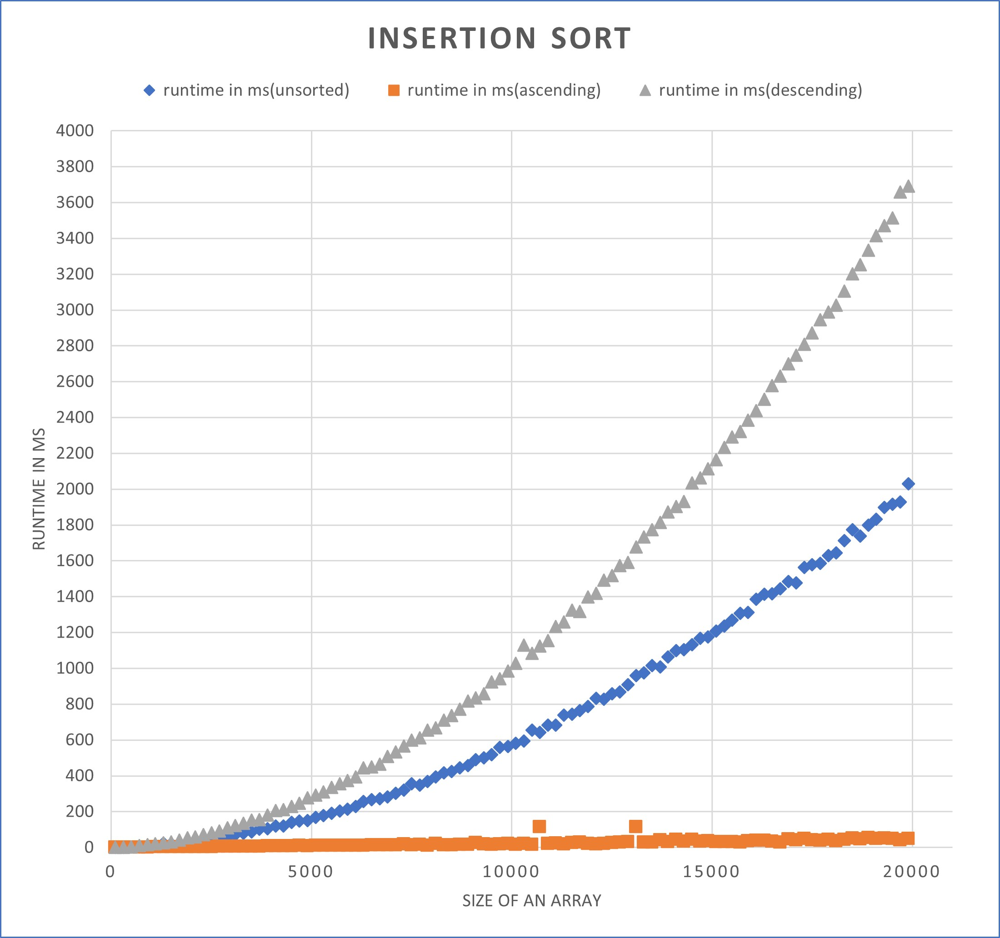
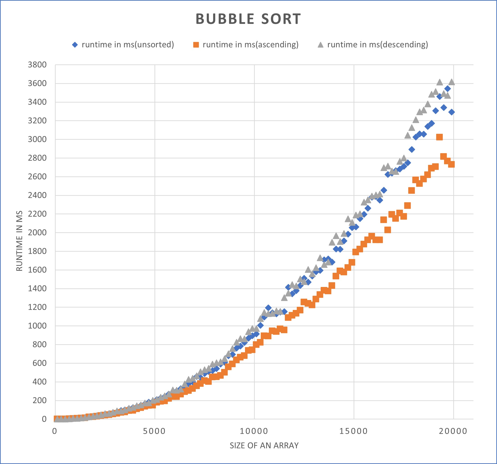
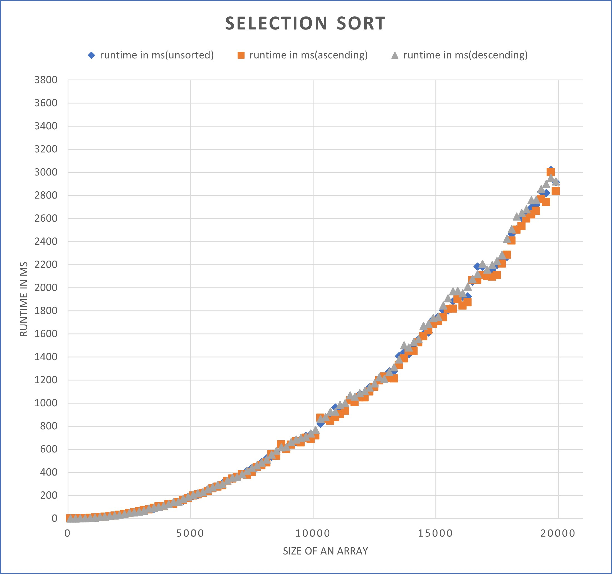

# Post analysis of sorting algorithms

## Code overview
<ul>
<li> Program runs the sorting algorithms for given number of input limit. </li>
<li> Program uses <a href="https://en.cppreference.com/w/cpp/header/chrono">chrono</a> library</li>
<li> Program tests algorithm for various input types such as random input (using <a href="https://en.cppreference.com/w/cpp/header/random">random</a>), input in ascending or descending order</li>
<li> Program generates .csv file for gathered data</li>
</ul>

## Analysis of insertion sort

## Analysis of bubble sort

## Analysis of selection sort

<small>*program was tested only on linux</small>